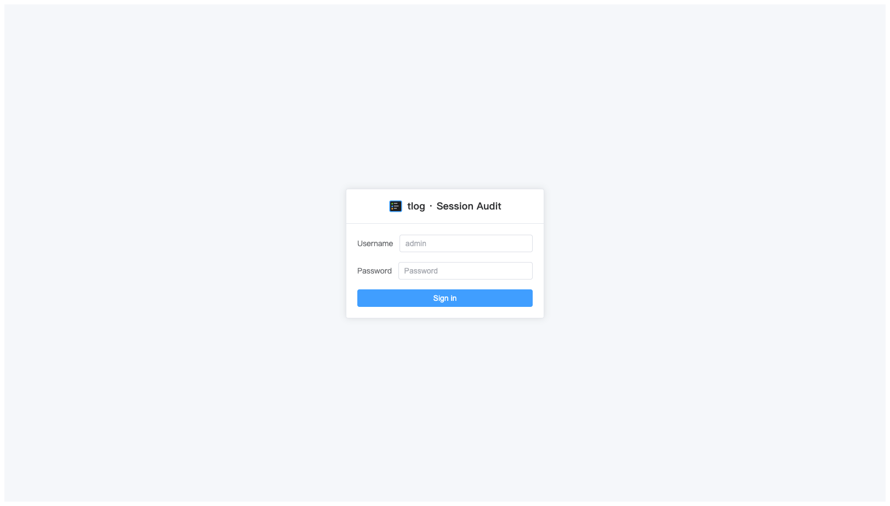
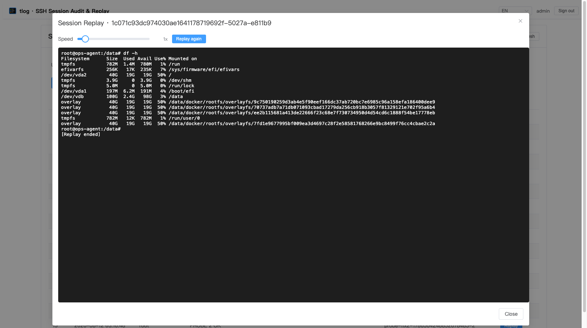

# tlog-web

[](https://github.com/min-organization/tlog-web/stargazers)
[](https://github.com/min-organization/tlog-web/releases)
[](https://github.com/min-organization/tlog-web/blob/main/LICENSE)
[](https://go.dev/)
[](https://vuejs.org/)
[](https://github.com/min-organization/tlog-web/blob/main/Dockerfile)

> 项目地址：https://github.com/min-organization/tlog-web

**语言 / Language:** [中文](#tlog-web) · [English](#english)

基于 [tlog](https://github.com/Scribery/tlog) 的 SSH 会话录制 **Web 审计与回放系统**。
后端用 Go 单二进制（无 CGO）采集 tlog 日志、建立 SQLite 会话索引、通过 WebSocket 按原始节奏回放终端流；
回放实体存于物理文件（不分桶 `<rec>.cast`），SQLite 仅存索引，避免大块录制流撑爆数据库；
前端用 Vue 3 + Vite + Element Plus，构建产物经 `//go:embed` 打进同一个二进制。
**一个容器、一个二进制、零前端运行依赖。**

## 功能

- 📼 **终端会话回放**：xterm.js + WebSocket，按 tlog TIMING 原始节奏（含延迟）重演，非简单文本堆叠
- 🔍 **会话检索**：按用户 / 日期范围 / 摘要+rec 全文搜索，后端分页
- 🐢 **回放调速**：0.1x ~ 8x 可调，支持「重新回放」
- 🔐 **Token 登录**：单 admin 用户，后端 JWT 鉴权（`/api/login` 签发，其余接口 `requireAuth` 校验）
- 🧹 **保留策略**：会话索引与对应回放文件按 `RETENTION_DAYS` 自动清理（先删文件再删索引，磁盘立即释放，不依赖 VACUUM）





## 与现有方案对比

tlog 生态目前缺少「轻量、独立、原生支持 tlog 格式」的 Web 审计界面。主流替代方案各有定位：

| 方案 | 定位 | 与 tlog-web 的差异 |
|---|---|---|
| [Scribery/tlog](https://github.com/Scribery/tlog) | tlog 本体（终端 I/O 记录器），自带命令行 `tlog-play` | 仅有 CLI 播放器，无 Web UI / 检索 / 多会话管理 |
| [Scribery/cockpit-session-recording](https://github.com/Scribery/cockpit-session-recording) | Cockpit 的会话录制 UI 插件 | 需整套 Cockpit 管理平台 + 特定发行版集成，重且耦合；tlog-web 是独立单二进制，零外部依赖 |
| [asciinema-player](https://github.com/asciinema/asciinema-player) | 通用终端录制 Web 播放器 | 仅消费 **asciinema** 格式；tlog 的 `TIMING`/`out_txt` 格式不兼容，无法直接回放 tlog 日志 |

**tlog-web 的差异化**：直接读取 tlog 日志文件、按 `TIMING` 原始节奏（含延迟）精确还原终端流、内置会话检索/分页/调速/鉴权，且编译为**单一静态二进制 + 前端自嵌入**，可独立部署于任意 Linux 服务器（含 ARM），无需 Cockpit 或外部数据库。


```
                 ┌──────────────┐
 用户 ─HTTPS──►  │  OpenResty   │  (可选：仅做 TLS 终结 + 反代，无业务认证)
                 │  :443        │
                 └──────┬───────┘
                        │ tlog-web:8080  (OpenResty 经 host.docker.internal:38081 反代，不依赖固定网络)
                 ┌──────▼───────┐
                 │  tlog-web    │  Go 单二进制
                 │  :8080       │  - collector：glob 监听 tlog 日志，增量索引到 SQLite
                 │              │  - HTTP API + WS 回放（token 鉴权）
                 │              │  - 内嵌 Vue 前端（//go:embed frontend/dist）
                 └──────────────┘
                        │
            /var/log/tlog (只读)   ./data (SQLite 索引 + 断点，bind mount 持久化)
                                  ./recordings (回放实体文件，不分桶 `<rec>.cast`，bind mount 持久化)
```

> 也可**脱离 OpenResty 独立部署**：直接映射 `8080` 端口，认证由后端自身负责。
> 注意：直连 `8080` 为 HTTP 明文，生产务必走 HTTPS（OpenResty / 反向代理 / 负载均衡做 TLS）。

## 目录结构

```
tlog-web/
├── Dockerfile            # 多阶段：node 构建前端 → embed 进 Go 二进制 → alpine 运行
├── docker-compose.yml
├── .env.example          # 配置样例（复制为 .env 修改）
├── backend/              # Go 模块（collector / replay / db / server / auth）
│   ├── server.go         # 路由 + SPA 服务 + /api/sessions(分页/搜索/日期) + /api/ws/play
│   ├── auth.go           # JWT 登录签发 + requireAuth 中间件（自建 HS256，零依赖）
│   ├── db.go             # SQLite 会话索引读写（sessions 表含 file_path，回放流已移出 DB 存文件）
│   ├── collector.go      # harvester 模型：glob 监听 + 多文件 checkpoint + 自愈
│   └── replay.go         # tlog TIMING 双格式解析 + WS 回放
├── frontend/             # Vue3 + Vite + Element Plus
│   └── src/ (api/ components/ views/)
└── data/                 # bind mount：SQLite 索引 + collector 断点（运行时生成）
└── recordings/           # bind mount：回放实体文件（不分桶 `<rec>.cast`，运行时生成，受 RETENTION_DAYS 清理）
```

## 快速开始

### 0. 日志采集前置（主机侧 tlog）

tlog-web **只读取** tlog 已产生的录制日志，自身不录制终端。主机必须先安装并配置 [tlog](https://github.com/Scribery/tlog)，使其把会话写入 `LOG_DIR`/`LOG_FILE`（默认 `/var/log/tlog/tlog-session.log`）。

tlog 对版本**无硬性要求**：只要其输出"每行一个 JSON、含 `rec`/`user`/`time`/`out_txt`/`timing`/`in_txt` 字段"的录制格式即可（本仓库实测基于 tlog 14，也兼容同格式的其他版本）。

**最小可用配置（经验证）：**

tlog 默认即以 `writer=file` 写入 `/var/log/tlog/tlog-session.log`，通常**无需额外配置文件**。只需让需要录制的用户以 `tlog-rec-session` 作为登录 shell，其 SSH 会话即被录制：

```bash
# 安装（Debian/Ubuntu 示例；RHEL/CentOS 用 dnf/yum install tlog）
apt-get install -y tlog

# 将需要审计的用户改为 tlog 录制 shell（每个需录制的用户执行一次）
usermod -s /usr/bin/tlog-rec-session <USER>

# 日志目录（tlog 默认路径，确保可写）
mkdir -p /var/log/tlog
```

如需自定义日志路径/ writer，可显式建 `/etc/tlog/tlog-rec.conf`（JSON，允许 C/C++ 注释）：

```json
{
    "writer": "file",
    "file": { "path": "/var/log/tlog/tlog-session.log" },
    "shell": "/bin/bash"
}
```

- **logrotate**：tlog 不响应信号重开日志，须用 **`copytruncate` + `delaycompress` + `rotate 14`**，**不要**用 rename 轮转（否则 inode 变化，tlog-web 的断点 checkpoint 需重新对齐，虽能自愈但会短暂重复扫描）。
- tlog-web 以**只读**挂载 `/var/log/tlog`，主机侧 tlog 正常写入即可，无需其它配置。
- 对 tlog 版本无硬性下限；如未来 tlog 改 JSON 字段名（概率极低），需同步更新 `collector.go` 的 `parseLine`。

> 若主机未产生 tlog 日志，tlog-web 会话列表为空——这是数据源问题，不是服务故障。

### 1. 准备配置

```bash
cp .env.example .env
# 编辑 .env，至少修改 TLOG_KEY 和 TLOG_SECRET 为强密码/随机串
```

### 2. 启动

```bash
# 反代说明：OpenResty 经 host.docker.internal:38081 静态反代到本容器（容器内监听 8080），
# 不依赖固定 docker 网络。compose 仅做端口映射 38081:8080，无需额外网络配置。
docker compose up -d --build
```

- 前端：`https://<your-domain>` 或 `http://<host>:8080`
- 默认账号：`admin` / 你在 `.env` 设置的 `TLOG_KEY`

## 配置项（环境变量）

| 变量 | 默认 | 说明 |
|---|---|---|
| `TLOG_USER` | `admin` | 登录用户名 |
| `TLOG_KEY` | `changeme` | 登录密码（**必须改强密码**） |
| `TLOG_SECRET` | 复用 `TLOG_KEY` | JWT 签名密钥（**建议设独立随机串**） |
| `LOG_DIR` | `/var/log/tlog` | tlog 日志目录 |
| `LOG_FILE` | `tlog-session.log` | 日志文件名 |
| `DB_PATH` | `/data/tlog.db` | SQLite 会话索引路径（**仅存索引，不含回放流**，文件小且稳定） |
| `STATE_PATH` | `/data/collector.state` | collector 断点路径 |
| `REC_DIR` | `/data/recordings` | 回放实体文件根目录（不分桶 `<rec>.cast`，**可配置**） |
| `RETENTION_DAYS` | `7` | 会话索引与对应回放文件保留天数（到期启动即清理 + 每小时周期清理；可按需通过 env 调整） |
| `SPEED_MAX` | `8` | 回放速度上限（x） |
| `HTTP_ADDR` | `0.0.0.0:8080` | 监听地址 |
| `LOGIN_MAX_ATTEMPTS` | `5` | 单 IP 登录失败锁定阈值（超限返回 429） |
| `LOGIN_LOCK_WINDOW_MIN` | `5` | 登录失败计数滑动窗口（分钟），超时清零 |

## API 概览

| 方法 | 路径 | 鉴权 | 说明 |
|---|---|---|---|
| POST | `/api/login` | 公开 | `{user,key}` → `{token}` |
| GET | `/api/sessions` | token | 分页+过滤：`page,page_size,user,q,date_from,date_to` → `{total,page,page_size,items}` |
| GET | `/api/users` | token | 去重用户列表 |
| GET | `/api/ws/play/:rec?speed=` | token（`Sec-WebSocket-Protocol` 子协议 `Bearer <base64url(token)>`） | WebSocket 回放终端流（token 不在 URL，避免泄露到日志） |
| GET | `/healthz` | 公开 | 健康检查 |

所有受保护接口通过 `Authorization: Bearer <token>` 校验；WebSocket 回放通过 `Sec-WebSocket-Protocol: Bearer <base64url(token)>` 子协议传递。

## 安全提示

- **`.env` 含密码，已 gitignore，切勿提交。**
- token 有效期 12h，登出仅清除前端存储；单 admin 场景可接受。
- 直连 `:8080` 为 HTTP 明文，生产务必经 HTTPS 反向代理。
- 登录接口已内置失败限速：`LOGIN_MAX_ATTEMPTS`（默认 5 次）/ `LOGIN_LOCK_WINDOW_MIN`（默认 5 分钟），单 IP 超限返回 429；公网部署仍建议前置 fail2ban / WAF / OpenResty 限流做纵深防御。

## 裸二进制部署

无需 Docker。后端为**纯 Go（无 CGO）单二进制**，前端已 `//go:embed` 打入，可直接在目标服务器运行。

### 一键构建

```bash
# 方式 A：构建脚本（默认 linux/amd64，可传 GOOS/GOARCH）
./scripts/build.sh linux amd64

# 方式 B：Makefile
make build                 # 等价于上面的 linux/amd64
GOOS=linux GOARCH=arm64 make build   # 交叉编译 ARM64
```

产物：`tlog-web-linux-amd64`（约 11MB，静态链接，无 libc/sqlite 依赖）。

### 运行

```bash
# 准备配置
cp .env.example .env && vim .env      # 改 TLOG_KEY / TLOG_SECRET

# 运行（需可读 tlog 日志目录，且 DB 路径可写）
./tlog-web-linux-amd64
```

运行前置：

- **tlog 日志**：`LOG_DIR`/`LOG_FILE` 指向真实录制日志（默认 `/var/log/tlog/tlog-session.log`，建议只读挂载）
- **SQLite**：`DB_PATH` 指向可写路径（默认 `/data/tlog.db`，首次自动建库，仅存索引）
- **回放文件**：`REC_DIR` 指向可写路径（默认 `/data/recordings`，不分桶存回放实体 `<rec>.cast`，受 `RETENTION_DAYS` 清理）
- **端口**：`HTTP_ADDR` 默认 `:8080`，需开放防火墙
- **⚠️ TLS**：二进制仅提供 **HTTP**。直连 `:8080` 为明文，公网务必前置 Nginx/OpenResty/Caddy 做 HTTPS，或仅在内网暴露

### 多平台

| 平台 | 命令 |
|---|---|
| Linux x86_64 | `make build` |
| Linux ARM64 (树莓派等) | `GOOS=linux GOARCH=arm64 make build` |
| macOS Apple Silicon | `GOOS=darwin GOARCH=arm64 make build` |

### Release 自动构建

推送 `v*` tag 时，GitHub Actions 自动为 linux(amd64/arm64/arm) + darwin(amd64/arm64) 构建二进制并附到 Release。

## 本地开发

```bash
# 前端
cd frontend && npm install && npm run dev      # Vite dev server :5173

# 后端（需先 npm run build 生成 frontend/dist）
cd backend && go run .                           # :8080，embed 前端 dist
```

## 构建镜像

```bash
docker compose build     # 多阶段：node → go → 单二进制 alpine 镜像
```

---

MIT License © min-organization

---

## English

> Project: https://github.com/min-organization/tlog-web

**Language:** [中文](#tlog-web) · [English](#english)

A **Web audit & replay system** for SSH session recording based on [tlog](https://github.com/Scribery/tlog).
The Go backend (single binary, no CGO) collects tlog logs, builds a SQLite session index, and replays the terminal stream over WebSocket at the original pace; replay entities are stored as physical files (flat `<rec>.cast` layout), with SQLite holding only the index so the database never balloons from large recording streams. The frontend is built with Vue 3 + Vite + Element Plus and embedded into the same binary via `//go:embed`.
**One container, one binary, zero frontend runtime dependencies.**

### Features

- 📼 **Terminal session replay**: xterm.js + WebSocket, re-enacting the tlog `TIMING` original pace (including delays) — not a naive text dump.
- 🔍 **Session search**: filter by user / date range / summary+rec full-text, server-side paginated.
- 🐢 **Replay speed control**: 0.1x ~ 8x adjustable, with "Replay again".
- 🔐 **Token login**: single admin user, backend JWT auth (`/api/login` issues the token; other endpoints are guarded by `requireAuth`).
- 🧹 **Retention policy**: session indexes and their replay files are auto-purged by `RETENTION_DAYS` (files removed before index rows, disk freed immediately without VACUUM).


### Comparison with existing solutions

The tlog ecosystem currently lacks a "lightweight, standalone, tlog-native" Web audit UI. Mainstream alternatives each have their own scope:

| Solution | Scope | Difference from tlog-web |
|---|---|---|
| [Scribery/tlog](https://github.com/Scribery/tlog) | tlog itself (terminal I/O recorder) with a CLI `tlog-play` | CLI player only — no Web UI / search / multi-session management |
| [Scribery/cockpit-session-recording](https://github.com/Scribery/cockpit-session-recording) | Cockpit's session-recording UI plugin | Requires the whole Cockpit management platform + distro-specific integration; heavy and coupled. tlog-web is a standalone single binary with zero external dependencies |
| [asciinema-player](https://github.com/asciinema/asciinema-player) | Generic terminal-recording Web player | Consumes **asciinema** format only; tlog's `TIMING`/`out_txt` format is incompatible, so tlog logs cannot be replayed directly |

**tlog-web's differentiation**: reads tlog log files directly, reconstructs the terminal stream at the original `TIMING` pace (including delays), with built-in session search / pagination / speed control / auth, compiled into a **single static binary with the frontend embedded** — deployable on any Linux server (including ARM) without Cockpit or an external database.

```
                 ┌──────────────┐
  user ─HTTPS──►  │  OpenResty   │  (optional: TLS termination + reverse proxy only, no business auth)
                 │  :443        │
                 └──────┬───────┘
                        │ tlog-web:8080  (OpenResty 经 host.docker.internal:38081 反代，不依赖固定网络)
                 ┌──────▼───────┐
                 │  tlog-web    │  Go single binary
                 │  :8080       │  - collector: glob-watch tlog logs, incrementally index into SQLite
                 │              │  - HTTP API + WS replay (token auth)
                 │              │  - embedded Vue frontend (//go:embed frontend/dist)
                 └──────────────┘
                        │
            /var/log/tlog (read-only)   ./data (SQLite index + checkpoint, bind mount for persistence)
                                  ./recordings (replay entity files, flat `<rec>.cast`, bind mount for persistence)
```

> Can also be deployed **without OpenResty**: just expose port `8080`; auth is handled by the backend itself.
> Note: a direct `8080` connection is plaintext HTTP — for production always use HTTPS (OpenResty / reverse proxy / load balancer for TLS).

### Directory layout

```
tlog-web/
├── Dockerfile            # Multi-stage: node builds frontend → embed into Go binary → alpine runtime
├── docker-compose.yml
├── .env.example          # Config sample (copy to .env and edit)
├── backend/              # Go module (collector / replay / db / server / auth)
│   ├── server.go         # routes + SPA serving + /api/sessions (pagination/search/date) + /api/ws/play
│   ├── auth.go           # JWT issue + requireAuth middleware (self-built HS256, zero deps)
│   ├── db.go             # SQLite session index (sessions table holds file_path; replay stream stored as files, not in DB)
│   ├── collector.go      # harvester model: glob watch + per-file checkpoint + self-heal
│   └── replay.go         # tlog TIMING dual-format parse + WS replay
├── frontend/             # Vue3 + Vite + Element Plus
│   └── src/ (api/ components/ views/)
└── data/                 # bind mount: SQLite index + collector checkpoint (generated at runtime)
└── recordings/           # bind mount: replay entity files (flat `<rec>.cast`, generated at runtime, purged by RETENTION_DAYS)
```

### Quick start

#### 0. Log collection prerequisite (host-side tlog)

tlog-web **only reads** the recordings tlog already produces — it does not record terminals itself. The host must have [tlog](https://github.com/Scribery/tlog) installed and configured to write sessions to `LOG_DIR`/`LOG_FILE` (default `/var/log/tlog/tlog-session.log`).

**No hard version requirement**: it only needs tlog to emit the "one-JSON-per-line" recording format with `rec`/`user`/`time`/`out_txt`/`timing`/`in_txt` fields (this repo is verified on tlog 14, and is compatible with other versions emitting the same format).

**Minimal working config (verified):**

By default tlog writes with `writer=file` to `/var/log/tlog/tlog-session.log`, so usually **no config file is needed**. Just set the login shell of the users you want audited to `tlog-rec-session`, and their SSH sessions get recorded:

```bash
# Install (Debian/Ubuntu shown; RHEL/CentOS: dnf/yum install tlog)
apt-get install -y tlog

# Set the audited user's shell to tlog's recording shell (once per user)
usermod -s /usr/bin/tlog-rec-session <USER>

# Log directory (tlog default path; ensure writable)
mkdir -p /var/log/tlog
```

To customize the path/writer, create `/etc/tlog/tlog-rec.conf` explicitly (JSON, C/C++ comments allowed):

```json
{
    "writer": "file",
    "file": { "path": "/var/log/tlog/tlog-session.log" },
    "shell": "/bin/bash"
}
```

- **logrotate**: tlog does not reopen the log on signal, so use **`copytruncate` + `delaycompress` + `rotate 14`**; do **not** use rename-based rotation (inode change forces tlog-web's checkpoint to realign — it self-heals but may briefly re-scan).
- tlog-web mounts `/var/log/tlog` read-only; nothing else to configure beyond host-side tlog writing.
- If the host produces no tlog logs, the tlog-web session list is empty — that is a data-source issue, not a service fault.

#### 1. Prepare config

```bash
cp .env.example .env
# Edit .env — at least set TLOG_KEY and TLOG_SECRET to strong/random values
```

#### 2. Launch

```bash
# Reverse proxy note: OpenResty proxies to this container via host.docker.internal:38081
# (container listens on 8080). No fixed docker network required; compose only maps 38081:8080.
docker compose up -d --build
```

- Frontend: `https://<your-domain>` or `http://<host>:8080`
- Default account: `admin` / the `TLOG_KEY` you set in `.env`


### Configuration (environment variables)

| Variable | Default | Description |
|---|---|---|
| `TLOG_USER` | `admin` | Login username |
| `TLOG_KEY` | `changeme` | Login password (**must be changed to a strong password**) |
| `TLOG_SECRET` | reuses `TLOG_KEY` | JWT signing secret (**recommend an independent random string**) |
| `LOG_DIR` | `/var/log/tlog` | tlog log directory |
| `LOG_FILE` | `tlog-session.log` | Log file name |
| `DB_PATH` | `/data/tlog.db` | SQLite session index path (**index only, no replay stream — small and stable**) |
| `STATE_PATH` | `/data/collector.state` | collector checkpoint path |
| `REC_DIR` | `/data/recordings` | replay entity root dir (flat `<rec>.cast`, **configurable**) |
| `RETENTION_DAYS` | `7` | retention days for session index + its replay files (purged on startup + hourly; adjustable via env) |
| `SPEED_MAX` | `8` | max replay speed (x) |
| `HTTP_ADDR` | `0.0.0.0:8080` | listen address |
| `LOGIN_MAX_ATTEMPTS` | `5` | per-IP failed-login lock threshold (returns 429 above it) |
| `LOGIN_LOCK_WINDOW_MIN` | `5` | sliding window (minutes) for failed-login counter; expires afterward |

### API overview

| Method | Path | Auth | Description |
|---|---|---|---|
| POST | `/api/login` | public | `{user,key}` → `{token}` |
| GET | `/api/sessions` | token | paginated + filtered: `page,page_size,user,q,date_from,date_to` → `{total,page,page_size,items}` |
| GET | `/api/users` | token | deduplicated user list |
| GET | `/api/ws/play/:rec?speed=` | token (`Sec-WebSocket-Protocol` subprotocol `Bearer <base64url(token)>`) | WebSocket terminal-stream replay (token not in URL, avoids log leakage) |
| GET | `/healthz` | public | health check |

All protected endpoints are validated via `Authorization: Bearer <token>`; WebSocket replay passes the token via the `Sec-WebSocket-Protocol: Bearer <base64url(token)>` subprotocol.

### Security notes

- **`.env` contains secrets and is gitignored — never commit it.**
- Token lifetime is 12h; logout only clears frontend storage. Acceptable for single-admin use.
- A direct `:8080` connection is plaintext HTTP — for production always put it behind an HTTPS reverse proxy.
- The login endpoint has built-in brute-force throttling: `LOGIN_MAX_ATTEMPTS` (default 5) / `LOGIN_LOCK_WINDOW_MIN` (default 5 min); a single IP over the limit returns 429. For public exposure, still put fail2ban / WAF / OpenResty rate-limiting in front as defense-in-depth.

### Bare-binary deployment

No Docker needed. The backend is a **pure Go (no CGO) single binary** with the frontend embedded via `//go:embed`, runnable directly on the target server.

#### One-shot build

```bash
# Option A: build script (default linux/amd64, pass GOOS/GOARCH as needed)
./scripts/build.sh linux amd64

# Option B: Makefile
make build                 # equivalent to linux/amd64 above
GOOS=linux GOARCH=arm64 make build   # cross-compile ARM64
```

Artifact: `tlog-web-linux-amd64` (~11MB, statically linked, no libc/sqlite dependency).

#### Run

```bash
# Prepare config
cp .env.example .env && vim .env      # change TLOG_KEY / TLOG_SECRET

# Run (needs read access to tlog log dir and a writable DB path)
./tlog-web-linux-amd64
```

Prerequisites:

- **tlog logs**: `LOG_DIR`/`LOG_FILE` point to real recording logs (default `/var/log/tlog/tlog-session.log`, recommend read-only mount)
- **SQLite**: `DB_PATH` points to a writable path (default `/data/tlog.db`, auto-created on first run; **index only**)
- **Replay files**: `REC_DIR` points to a writable path (default `/data/recordings`, flat replay entities `<rec>.cast`, purged by `RETENTION_DAYS`)
- **Port**: `HTTP_ADDR` defaults to `:8080`, open the firewall
- **⚠️ TLS**: the binary serves **HTTP only**. A direct `:8080` connection is plaintext — for public exposure always put Nginx/OpenResty/Caddy in front for HTTPS, or expose it only on an internal network

#### Multi-platform

| Platform | Command |
|---|---|
| Linux x86_64 | `make build` |
| Linux ARM64 (Raspberry Pi, etc.) | `GOOS=linux GOARCH=arm64 make build` |
| macOS Apple Silicon | `GOOS=darwin GOARCH=arm64 make build` |

#### Release auto-build

Pushing a `v*` tag triggers GitHub Actions to build binaries for linux(amd64/arm64/arm) + darwin(amd64/arm64) and attach them to the Release.

### Local development

```bash
# Frontend
cd frontend && npm install && npm run dev      # Vite dev server :5173

# Backend (run npm run build first to produce frontend/dist)
cd backend && go run .                           # :8080, embeds frontend dist
```

### Build image

```bash
docker compose build     # multi-stage: node → go → single-binary alpine image
```

---

MIT License © min-organization
